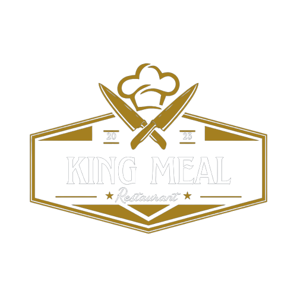

# King Meal Restaurant Management Website

  

The King Meal Restaurant Management Website is a comprehensive online platform designed to facilitate seamless restaurant operations. This website serves multiple user roles, including customers, admin, cashiers, and staff. It offers a user-friendly interface with various features and functionalities to enhance the restaurant's efficiency and improve the overall customer experience.

&nbsp;

---

## Table of Contents

- [Introduction](#introduction)
- [Features](#features)
- [Usage](#usage)
- [Technologies Used](#technologies-used)
- [Languages](#languages)
- [Contributors](#contributors)
- [Acknowledgement](#acknowledgment)

---

## Introduction

The King Meal Restaurant Management Website is the beating heart of the King Meal Restaurant, catering to a diverse array of stakeholders, including customers, admin personnel, cashiers, and dedicated staff. This online platform encapsulates the very essence of modern restaurant management, melding innovation with tradition, and delivering a new standard of excellence.

## Features

### For Customers
- Menu Viewing
- Discounts and Specials
- Ordering
- Feedback

### For Admin
- Comprehensive Dashboard
- User Management
- Performance Analytics

### For Cashiers
- Menu Item Management
- Payment Processing

### For Staff
- Order Management
- Task List

## Usage

To run the King Meal Restaurant Management System on your local machine, follow these steps:

- Ensure that you have XAMPP installed on your system.
- Clone this repository to your local machine.
- Open XAMPP and start the Apache and MySQL services.
- Import the provided MySQL database file.
- Copy the project files to the 'htdocs' directory in your XAMPP installation folder.
- Open a web browser and navigate to http://localhost/restaurant to access the website.

## Technologies Used

- CSS (Cascading Style Sheets)
- PHP (Hypertext Preprocessor)
- JavaScript
- Database (MySQL)
- XAMPP
- Visual Studio Code (VS Code)

## Languages

- HTML
- CSS
- JavaScript
- PHP
- SQL

## Contributors

- [Tharusha Dilhara](https://github.com/tha-rusha)
- [Nimsara Kobbekaduwa](https://github.com/kobbekaduwa22)
- [Sanduni Upekha](https://github.com/SanduniUpekha)
- [Tharangani Jayasuriya](https://github.com/Thara-ngani)
- [Jayani Malshika](https://github.com/JayaniMalshika)
- [Savodya Samarasinghe](https://github.com/savodya)
- [Tharani Yasara](https://github.com/TharaniYasara)
- [Anudi Sulakshana](https://github.com/AnudiSulakshana)
- [Voleena Ivon](https://github.com/voleena)
- [Noori Manisha](https://github.com/noorimanisha)

## Acknowledgment

We would like to express our gratitude to all those who have supported and contributed to the development of the King Meal Restaurant Management System project. We appreciate the collective effort that has gone into making this project a success.

---

